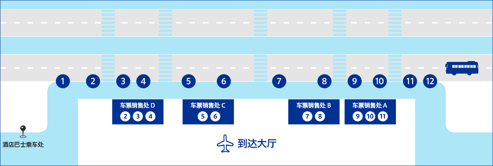
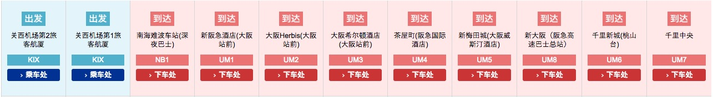
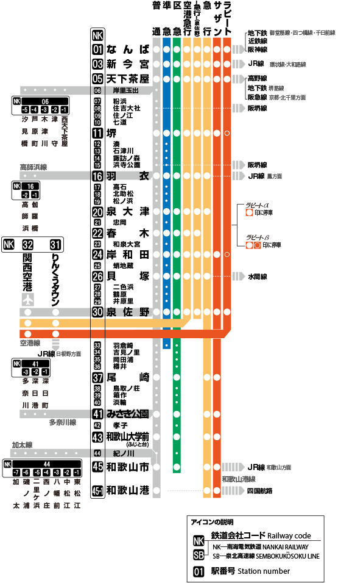
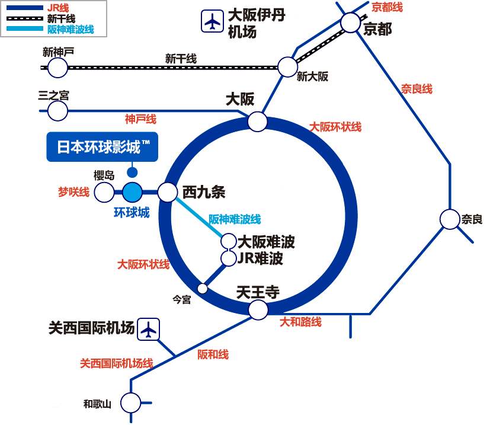
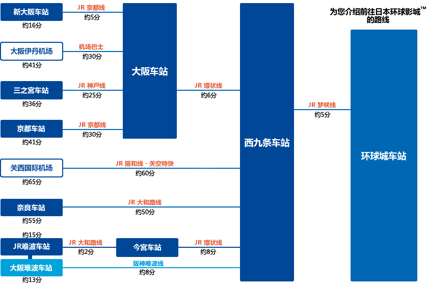
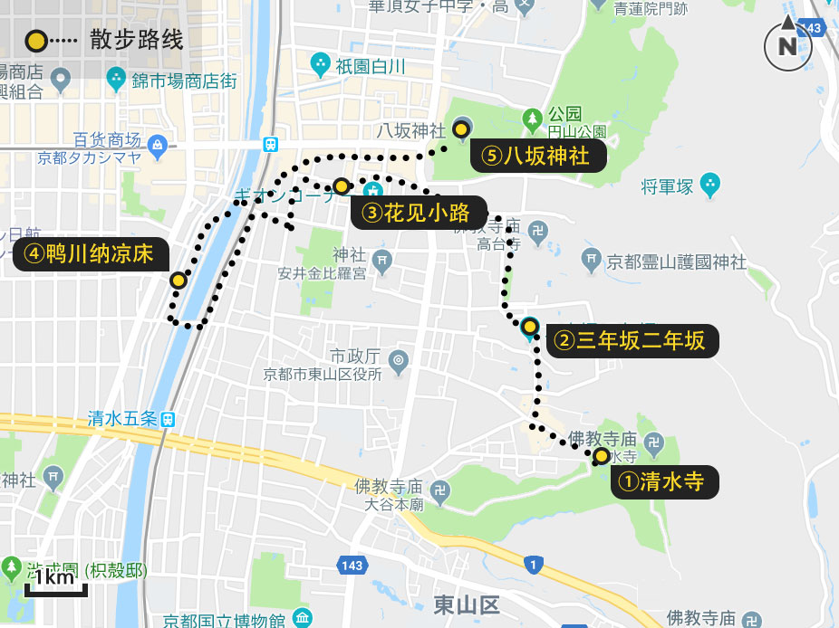
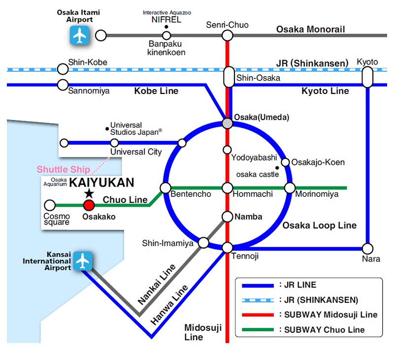
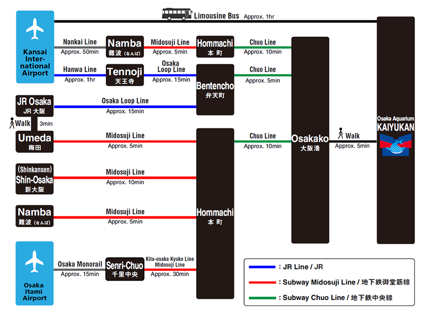
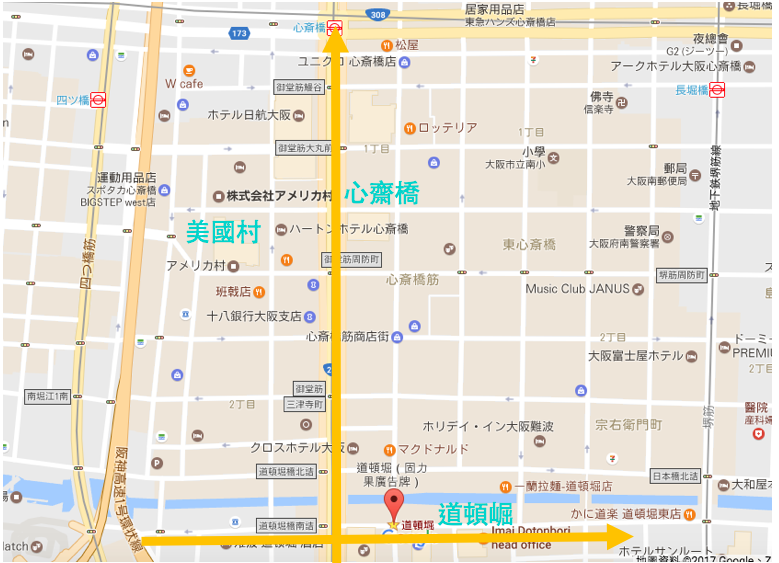

# 大阪 6 日游

> 酒店选择原则主要有四点：新酒店比旧酒店好，距离车站近比远好，干净整洁比杂乱好，大型连锁品牌比小型杂牌酒店好。

## Day 1

### 1.1 浦东国际机场(08:05) -> 关西机场(11:20)

> T2 -> T1 航站楼可搭乘免费机场巴士、约 10 分钟车程

- ICOCA 卡充值（一次充 ¥2000 即可）

### 1.2 关西机场 -> 大阪新阪急酒店

- 方案一：JR 线（蓝色）

  - 乘坐关西机场快速、约需 65 分钟

- 方案二：机场大巴

  - 关西机场第 1 航站楼 ⇒ 大阪车站前(新阪急酒店)　约 58 分钟

运营时间 7:00-23:00，平均每小时有 3 辆车，具体[时刻表](http://www.kate.co.jp/timetable/detail/UM)查询，单程票是 ¥1550，来回是 ¥2760，14 天内有效。

第 1 旅客航厦 1F 机场专线巴士乘车处

> UM 位置 5 - 前往大阪站前・茶屋町・新梅田城・新大阪・千里新城

> 离开关西机场后的第一站即可下车

- 方案三：Nankai（橘红色）
  - 乘坐 Rapi:t α、约需 34 分钟
  - 乘坐 Rapi:t β、约需 39 分钟
  - 乘坐机场快车、约需 43 分钟

- Nankai 路线：关西空港车站 -> 43min -> 难波(なんば) 换乘 御堂筋线 -> 9min/15min (4 站) -> 梅田

### 1.3 奥特莱斯

> 地址：泉佐野市りんくう往来南 3-28

- 交通： 关西空港车站 -> 1 站 -> 临空城(りんくうタウン駅) -> 下車徒歩約 5 分 -> 奥特莱斯(りんくうプレミアム・アウトレット)

**Tips:** 地跌站内有临时寄存箱， ¥700 可寄存一个大行李箱（寄存箱旁有零钱兑换机）

### 1.4 入住大阪新阪急酒店 & 晚餐

- 和牛饭（阪急三番街店）
- 一兰拉面（24H 营业）

> 二选一

## Day 2

### [日本环球影城](https://www.usj.co.jp/)

- 营业时间：9:00 〜 20:30（2019.05）
- 门票
  - 1 日 周游券： ¥6,852 (含稅 ¥7,400) 起
  - 2 日 周游券： ¥13,612 (含稅 ¥14,700)

> 预售票：无需在售票亭办理换票，可直接入场（官方指定中国代理商：[飞猪](https://universalstudiosjapan.fliggy.com/)，[Klook](https://www.klook.com/zh-CN/activity/835-universal-studios-japan-ticket-osaka/)）或各大旅游网（最后我们选择了**马蜂窝**）

- 交通：在 JR 西九条站转乘 JR 梦咲线，至「环球城」站

**午餐**（环球影城）

- 美式热狗/小黄人餐厅/西班牙油条/哈里特特黄油啤酒

**晚餐**（梅田）

- 鱼心（刺身寿司）
- 春驹（老字号）(周二休息，平时 11:00-22:00）

> 二选一

## Day 3

### <del>3.1 八坂神社</del>

> 地址：〒 605-0073 京都府京都市東山区祇園町北側 625

- 交通：阪急京都线（梅田）-> 44 分钟 -> 河原町（京都）
- 费用：¥400、约需 1 小时

### <del>3.2 清水寺</del>

> 地址：〒 605-0862 京都府京都市東山区辰巳町 294

- 交通：步行 1.7 公里、约 26 分钟

途径二年坂、三年坂可逛吃

### 3.3 白须神社（可看日落）

> 地址：〒 520-1122 滋賀県高島市鵜川２１５番地

**Tips:** 景点在高速旁边，需注意安全

- 交通：JR 湖西线
- 费用： ¥840、约需 41-53 分钟

从『京都站』乘坐 JR 湖西线 到『近江高岛站』，这是离白须最近的车站，距离白须还有约 2.6 公里。只有两个办法，打车或徒步。

> PS：如需打车，可以寻找车站工作人员，让他帮忙打电话呼叫 TAXI。

日本的出租车非常昂贵，应该说日本的交通都非常的昂贵。公交车是 ¥240 一次，相当于国内 12 块钱做一次公交。而从车站打到白须则需要 ¥1190（约国内 70 元）。

> PS：回程如需打车，可以去找神社的工作人员帮忙打电话叫 TAXI。

之后乘坐 JR 返回了 大阪

- 交通：JR 湖西线
- 费用： ¥1490、约需 1 小时 10 分钟

## Day 4

### 4.1 [大阪海游馆](https://www.kaiyukan.com/)

> 地址：大阪府大阪市港区海岸通 1-1-10

**Tips:** 海风大，需注意保暖

- 营业时间：9:30-20:00（May）
- 门票：¥2300（携程购买）
- 交通指南：从大阪站（或梅田站）出发约需 30 分钟

- 问讯处：出租语音导游系统 1 台 ¥500

> 当天可以多次重新进入海游馆。请在出口附近的服务台让工作人员在自己的手背上盖上透明的图章，以便再次入馆时确认。请大家在用餐之后继续尽情游览海游馆。

**美食**

- Sea Saw 咖啡厅（2F）
- 鲨鱼冰淇淋

### <del>4.2 梅田蓝天大厦</del>

> 地址：大阪市北区大淀中 1-1-88

- 开放时间：10:00~22:30(最终入场至 22:00 为止)
- 门票：¥1000
- 交通：JR 大阪环状线，JR 大阪站

## Day 5

### <del>购物为主</del>

1. **心斋桥**是买美妆、衣服、鞋子的购物地点
2. **道顿崛**则是以美食居多（部分店家营业时间也相对来说较晚）
3. 如果是想要爱好潮牌的人则可以到**美国村**，美国村就连街道也充满美式风格，可以选择从难波站出来之后，沿着戎桥筋直走就可以经过道顿崛、心斋桥等。

- 交通
  - 美国村：地铁四つ桥线，四ツ桥站
  - 心斋桥：地铁御堂筋线、长堀鹤见绿地线，心斋桥站
  - 道顿崛：阪神难波线、近铁奈良线，难波站；近铁奈良线，日本桥站

### 休闲游为主

- 大阪城公园
- 宝可梦中心

## Day 6 回家

- 方案一：机场巴士
  - 大阪车站前(新阪急酒店)⇒ 关西机场第 1 航站楼、约 50 分钟
- 方案二：JR 线
  - 大阪站 关空特快 -> 1h10min (¥1190) -> 关西机场

**Tips:** 需注意列车广播信息，我们就乘坐了一班半途会分离的列车（前 4 节开往关西机场，后 4 节开往和歌山）

## 附录

### 大阪可选景点

1. 大阪城公园：自然美景
2. 通天阁：大阪艾菲尔铁塔
3. 海游馆：世界最大的水族馆
4. 梅田蓝天大厦空中庭园展望台：赏夜景
5. 大阪环球影城：必去
6. 黑门市场：市场
7. 心斋桥、道顿崛、美国村：购物/美食
8. 天神桥筋商店街：日本最长的商店街

### 旅游必备软件

- Google Maps（可搭配 换乘案内 一起使用）
- Google Translate
- Google Chrome
- 大众点评
- 支付宝（或者直接使用银联卡）
