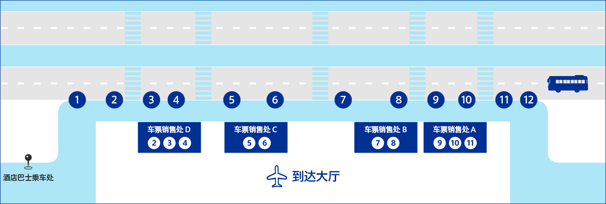
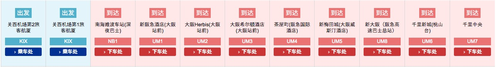
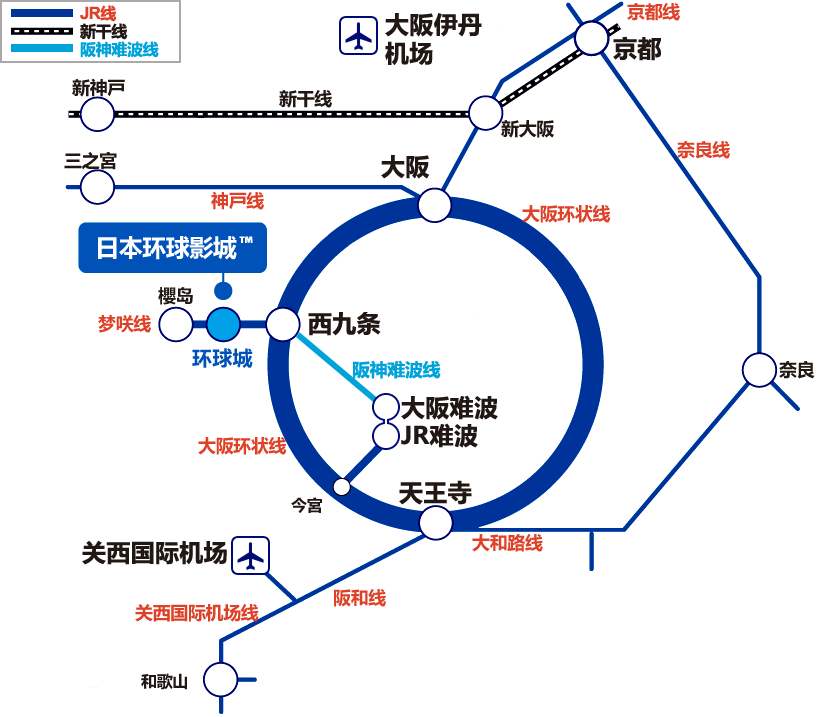
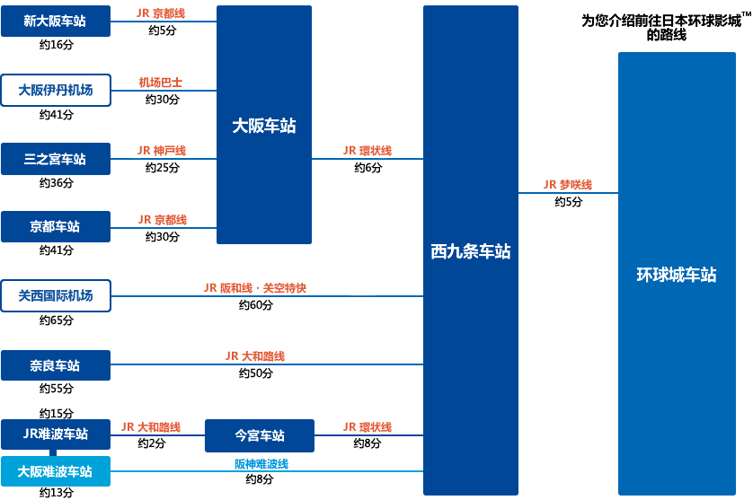
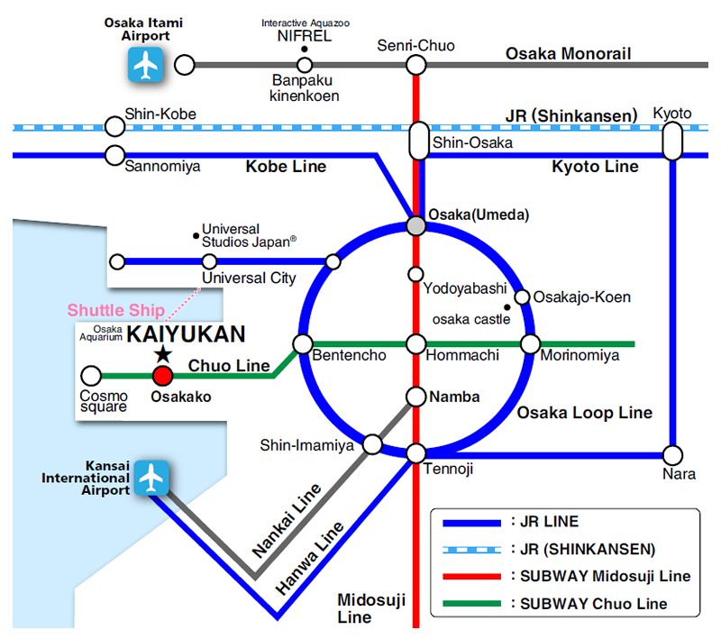
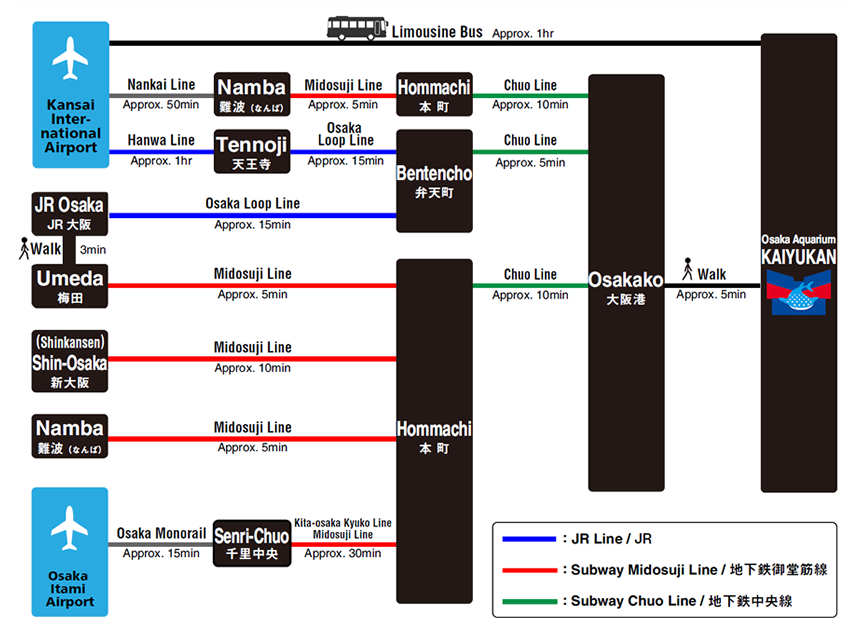
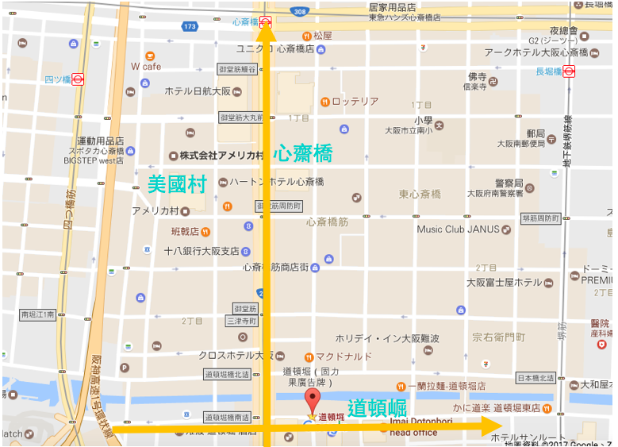

## 大阪 6 日游

> 酒店选择原则主要有四点：新酒店比旧酒店好，距离车站近比远好，干净整洁比杂乱好，大型连锁品牌比小型杂牌酒店好。

可选景点：

1. 大阪城公园：自然美景
2. 通天阁：大阪艾菲尔铁塔
3. 海游馆：世界最大的水族馆
4. 梅田蓝天大厦空中庭园展望台：赏夜景
5. 大阪环球影城：必去
6. 黑门市场：市场
7. 心斋桥、道顿崛、美国村：购物/美食
8. 天神桥筋商店街：日本最长的商店街

## Day 1

#### 1.1 浦东国际机场 -> 关西机场

#### 1.2 关西机场 -> 大阪新阪急酒店

- 方案一：JR 线（蓝色）

  - 乘坐关西机场快速、约需 65 分钟

- 方案二：机场大巴

  - 关西机场第 1 航站楼 ⇒ 大阪车站前(新阪急酒店)　约 58 分钟

运营时间 7:00-23:00，平均每小时有 3 辆车，具体[时刻表](http://www.kate.co.jp/timetable/detail/UM)查询，单程票是 1550 日元，来回是 2760 日元，14 天内有效。

第 1 旅客航厦 1F 机场专线巴士乘车处

> UM 位置 5 - 前往大阪站前・茶屋町・新梅田城・新大阪・千里新城

> 离开关西机场后的第一站即可下车

- 方案三：Nankai（橘红色）
  - 乘坐 Rapi:t α、约需 34 分钟
  - 乘坐 Rapi:t β、约需 39 分钟
  - 乘坐机场快车、约需 43 分钟

> 关西空港车站 -> 43min -> 难波(なんば) 换乘 御堂筋线 -> 9min/15min (4 站) -> 梅田

## Day 2

#### [日本环球影城](https://www.usj.co.jp/)

- 营业时间：9:00 〜 20:30（2019.05）
- 门票
  - 1 日 周游券：￥ 6,852 (含稅 ￥ 7,400) 起
  - 2 日 周游券：￥ 13,612 (含稅 ￥ 14,700)

> 预售票：无需在售票亭办理换票，可直接入场（官方指定中国代理商：[飞猪](https://universalstudiosjapan.fliggy.com/)，[Klook](https://www.klook.com/zh-CN/activity/835-universal-studios-japan-ticket-osaka/)）

- 交通：在 JR 西九条站转乘 JR 梦咲线，至「环球城」站

**结论:**（以下是假设平日进入园区）

1. 要抢头香的朋友大概 06:10 ～ 06:30 到门口
2. 800 元台币的 VIP 手环建议不用买，因为一样要早起，开放入园的时间和一般匝口是一样的
3. 平日不用买快速通关，妥善利用 SINGLE 信道
4. 假如不是波特迷，哈利波特禁忌之旅晚上玩可以更省时间，因为夜光秀分散人潮
5. 相关整理票如果中午没有开始发的话，大概整天都不需要去抽整理票了(中央公园顾机台的工作人员讲的)
6. 园区有饮水机，可以带外食入园(塞入背包)
7. USJ APP 提供很多参考信息(尤其是排队时间)
8. 设施可能被天气限制
9. 旋转类游戏区请脱眼镜，我在玩鹰马的飞行工作人员叫我不需要脱，结果玩的时候差点变成他马眼镜的飞行，玩梦想成真时很有可能眼镜会以 v=wR 的速度跟你说再见
10. 我觉得如果假日进园区的话，也不太需要买这所谓的 VIP 手环（下文有分析）
11. 根据数据统计，园区高达六成的人来自日本当地人，日本人把环球影城当作消磨时间的公园，所以假日人一堆是可想而知的，因此假日真的怕排队排到爽的话，快速通关可能还是要纳入考虑

## Day 3

#### 3.1 京都游

清水寺 - 二年坂三年坂

#### 3.2 白须神社

转乘 JR 到【近江高岛站】，这是离白须最近的车站，距离白须还有约 2 公里。只有两个办法，打车或徒步。

我们选择打车，如果车站门口并没有 taxi，可以寻找车站工作人员，让他帮忙打电话呼叫出租车前来。

日本 的出租车非常昂贵，应该说 日本 的交通都非常的昂贵。公交车是 240 日元一次，相当于国内 12 块钱做一次公交。而从车站打到白须则需要 1190 日元（约国内 70 元）。

PS：回程打车，则可以去找神社的工作人员帮忙打电话叫 TAXI。

之后乘坐 JR 返回了 京都 。

## Day 4

#### 4.1 [大阪海游馆](https://www.kaiyukan.com/)

> 地址：大阪府大阪市港区海岸通 1-1-10

- 营业时间：9:30-20:00（May）
- 门票：2300 日元（携程购买）
- 交通指南：从大阪站（或梅田站）出发约需 30 分钟

- 问讯处：出租语音导游系统 1 台 500 日元

> 当天可以多次重新进入海游馆。请在出口附近的服务台让工作人员在自己的手背上盖上透明的图章，以便再次入馆时确认。请大家在用餐之后继续尽情游览海游馆。

#### 4.2 梅田蓝天大厦

> 地址：大阪市北区大淀中 1-1-88

- 开放时间：10:00~22:30(最终入场至 22:00 为止)
- 门票：1000 日元
- 交通：JR 大阪环状线，JR 大阪站

## Day 5

#### 购物为主

1. **心斋桥**是买美妆、衣服、鞋子的购物地点
2. **道顿崛**则是以美食居多（部分店家营业时间也相对来说较晚）
3. 如果是想要爱好潮牌的人则可以到**美国村**，美国村就连街道也充满美式风格，可以选择从难波站出来之后，沿着戎桥筋直走就可以经过道顿崛、心斋桥等。

- 交通
  - 美国村：地铁四つ桥线，四ツ桥站
  - 心斋桥：地铁御堂筋线、长堀鹤见绿地线，心斋桥站
  - 道顿崛：阪神难波线、近铁奈良线，难波站；近铁奈良线，日本桥站

## Day 6 回家

- 方案一：机场巴士
  - 大阪车站前(新阪急酒店)⇒ 关西机场第 1 航站楼　约 50 分钟
- 方案二：JR 线
  - 大阪站 关空特快 -> 1h10min (1190 Yen) -> 关西机场
